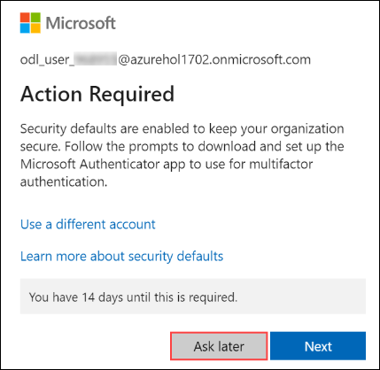

# Modernize Java Apps

### Overall Estimated Duration: 8 Hours

## Overview

In this lab, you will learn how to build and deploy both frontend and backend Spring applications to Azure Spring Apps. Starting with a basic hello-world Spring Boot app, you'll progress to deploying the ACME-FITNESS demo application, configuring Spring Cloud Gateway, and verifying frontend and backend access. You will modify Spring Cloud Gateway rules to enable communication with the Application Configuration Service and Service Registry. Additionally, you'll configure Single Sign-On using Microsoft Entra ID and connect applications to persistent stores, utilizing Azure Key Vault for secure secret and key management. The lab will also cover managing SSL/TLS certificates, enforcing role-based access policies, and monitoring application health through live metrics and logs. Lastly, you'll implement rate limiting for your APIs using Spring Cloud Gateway filters.

## Objectives

- Deploy and Build Applications
- Configure Single Sign-On
- Integrate with Azure Database for PostgreSQL and Azure Cache for Redis
- Load Application Secrets using Key Vault
- Monitor Applications End-to-End (Optional)
- Change the Application Code and Set Request Rate Limit (Optional)
- Automate from idea to production
- Infuse AI into Fitness Store

## Pre-requisites

## Architecture Diagram

# Getting Started with Lab

1. Once the environment is provisioned, a virtual machine (JumpVM) and lab guide will get loaded in your browser. Use this virtual machine throughout the workshop to perform the lab. You can see the number on the bottom of the lab guide to switch to different exercises of the lab guide.

   

1. To get the lab environment details, select the **Environment Details** tab. The credentials will also be emailed to your registered email address. You can open the Lab Guide on a separate and full window by selecting the **Split Window** from the lower right corner. Also, you can start, stop and restart virtual machines from the **Virtual Machines** tab.

   
 
    > You will see the SUFFIX value on the **Environment Details** tab, use it wherever you see SUFFIX or DeploymentID in lab steps.

## Login to Azure Portal
1. In the JumpVM, click on the Azure portal shortcut of the Microsoft Edge browser which is created on the desktop.

   
   
1. On the **Sign into Microsoft Azure** tab you will see a login screen, enter the following email/username and then click on **Next**. 
   * Email/Username: <inject key="AzureAdUserEmail"></inject>
   
   
     
1. Now enter the following password and click on **Sign in**.
   * Password: <inject key="AzureAdUserPassword"></inject>
   
   
     
   > If you see the pop-up Action Required, keep default and then click on Ask later.

   
  
1. If you see the pop-up **Stay Signed in?**, click No

1. If you see the pop-up **You have free Azure Advisor recommendations!**, close the window to continue the lab.

1. If a **Welcome to Microsoft Azure** popup window appears, click **Cancel** to skip the tour.
   
1. Now you will see the Azure Portal Dashboard, click on **Resource groups** from the Navigate panel to see the resource groups.

   
   
1. Confirm that you have all resource groups present as shown below. Open the **Modernize-java-apps** resource group and verify the resources present in it.

   
   
1. Now, click on the **Next** from the lower right corner to move to the next page.

## Support Contact
The CloudLabs support team is available 24/7, 365 days a year, via email and live chat to ensure seamless assistance at any time. We offer dedicated support channels tailored specifically for both learners and instructors, ensuring that all your needs are promptly and efficiently addressed.

Learner Support Contacts:

* Email Support: cloudlabs-support@spektrasystems.com
* Live Chat Support: https://cloudlabs.ai/labs-support
  
Now, click on Next from the lower right corner to move on to the next page.

# Happy Learning!!
